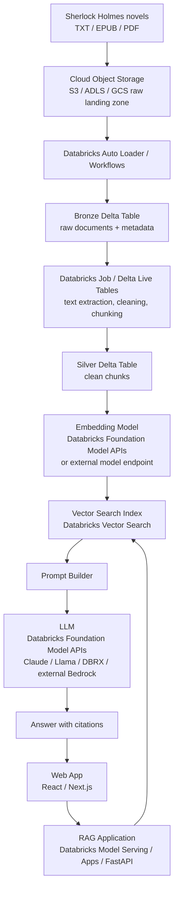
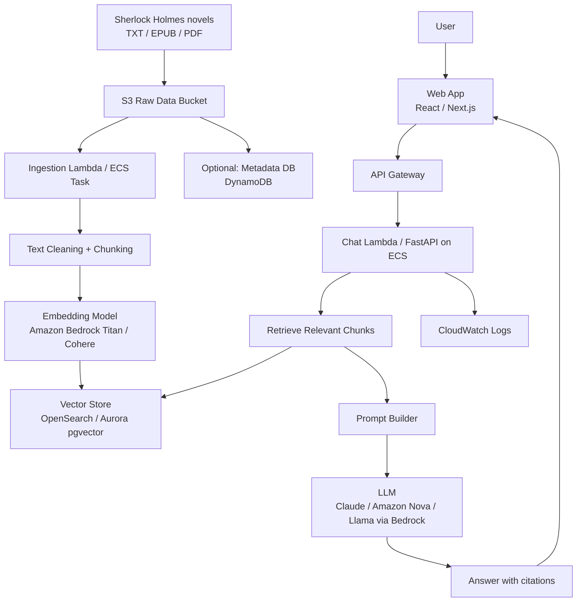

# App architectures

## Databricks


## AWS


## Git-style structure

```text
holmesrag/
  astro.config.mjs
  package.json
  src/
    components/
      HolmesRAGChat.astro
    pages/
      holmesrag.astro
      api/
        chat.js
    styles/
      holmesrag.css
```

## Run locally

```bash
npm install
npm run dev
```

Open:

```text
http://localhost:4321/holmesrag
```
